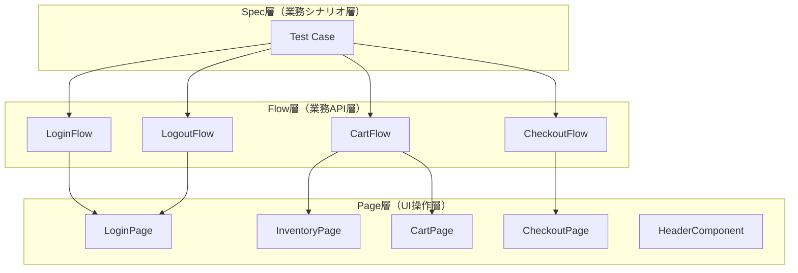
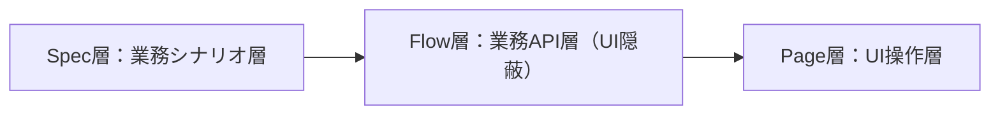
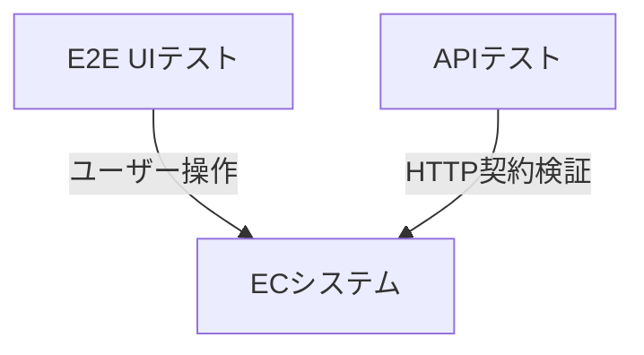

# Playwright 自動テストデモ（ECサイトE2Eテスト）

Playwright + TypeScript によるECサイト向けE2E自動テストポートフォリオです。

ログイン / カート / Checkout(購入) / ログアウト を対象に、保守性・拡張性・CI運用まで意識して実装しています。

**総テスト数：30件 / GitHub ActionsによるCI自動実行対応**

---

## テスト実装状況

本プロジェクトでは、E2E観点に基づき「状態変化・業務フロー単位」でテストを設計しています。

---

### 合計件数について

本プロジェクトのテスト件数は固定値ではなく、
業務シナリオ単位での網羅結果として定義されています。

そのため、機能追加・仕様変更により増減する前提の設計です。

---

### 設計方針

本プロジェクトはE2E観点でのユーザー操作フロー再現性と保守性を重視したテスト設計を採用しています。

詳細な設計思想は後述の「テスト設計方針」に整理しています。

---

### アーキテクチャ方針

保守性と運用性を意識し、以下の構成を採用しています。

- Page Object Model（POM）
- Fixtureによるログイン共通化
- Data-driven testing
- GitHub Actions による CI 自動実行

---

## 使用技術

- Playwright
- TypeScript
- Node.js
- GitHub Actions
- API Testing（APIRequestContext）
- Page Object Model
- Flow Layer Architecture
- Fixture / storageState
- Data-driven testing
- ReqRes API（外部API検証）

---

## テスト対象

**SauceDemo（テスト用デモサイト）**  
https://www.saucedemo.com/

---

## テスト設計方針（重要）

本プロジェクトは、E2E観点でのユーザー操作フロー再現性と保守性を重視したテスト設計を採用しています。

---

### 設計思想

#### ① Page Object Model（POM）
画面操作を機能単位で分離し、UI変更の影響を局所化しています。

対象：
- InventoryPage
- CartPage
- CheckoutPage
- HeaderComponent

---

#### ② Fixtureによる認証状態の共通化
loginFixtureによりログイン状態を共通化し、各テストの前処理を削減しています。

---

#### ③ テスト観点の分離
本プロジェクトでは、機能単位ではなくユーザー操作ベースでテストを分類しています。

- Login：認証系
- Cart：状態変化系
- Checkout：購入フロー系
- Logout：セッション管理
- API：HTTP契約検証

---

## テストアーキテクチャ構造（3層モデル）

本プロジェクトは以下の3層構造でテストを設計しています。



### ■ Spec層（業務シナリオ層）
- テストケースの定義
- 業務フローの組み立て
- Flow Layerのみを呼び出す
- UI操作は一切記述しない

例：
- 「商品を購入できること」
- 「ログイン失敗時にエラーが出ること」

---

### ■ Flow層（業務フロー層）

- Page Objectを組み合わせた業務単位の操作を提供
- UI操作の詳細（セレクタ・DOM構造）を完全に隠蔽
- spec層からUI依存を排除
- テストシナリオを業務レベルで表現する抽象化レイヤー

例：
- login()
- addItems()
- startCheckout()
- completePurchase()
- verifyOrderComplete()



---

### ■ Page層（UI実装層）
- 画面単位の操作を定義
- セレクタ・DOM操作を集約
- UI変更時の影響をこの層に閉じ込める
- Flow / SpecにはUI詳細を漏らさない

例：
- LoginPage
- CartPage
- CheckoutPage
- InventoryPage

---

## ■ Flow実装例（LoginFlow）

本プロジェクトでは、Flow層が業務操作を抽象化しています。

UI操作（Page Object）を直接呼ぶのではなく、
業務単位のメソッドとしてまとめることで、spec層の可読性と保守性を向上させています。

---

### LoginFlow.ts（例）

```
ts id="flow-login-example"
export class LoginFlow {
  constructor(private loginPage: LoginPage) {}

  async login(username: string, password: string) {
    await this.loginPage.open();

    await this.loginPage.enterUsername(username);
    await this.loginPage.enterPassword(password);

    await this.loginPage.clickLogin();
  }
}
```

---

## テスト戦略（状態ベース設計）

本プロジェクトでは「操作ベース」ではなく  
状態変化ベースのテスト設計を採用しています。

---

### 例：カートテスト

商品追加 → カート件数増加  
商品削除 → カート件数減少  
全削除 → バッジ非表示  

---

このように「操作」ではなく  
状態遷移の正しさを検証しています。

---

## ■ テスト詳細仕様（設計補足）

各機能の詳細なテスト設計（観点・シナリオ・状態遷移）はGitHub Wikiに分離しています。

詳細設計（GitHub Wiki）
https://github.com/Infinity941020/playwright-demo/wiki

- Login：認証フロー設計
- Cart：状態変化およびバッジ検証
- Checkout：E2E購入フロー設計
- Logout：セッション終了フロー

---

## Fixture対応（ログイン共通化）

本プロジェクトでは、Playwright Fixtureを利用して
ログイン済み状態を共通化しています。

### 現在の構成

- loginFixture.ts によるログイン済みPageの提供
- loggedPage を各テストで共通利用
- 前処理の重複排除
- テスト実行速度の最適化

### 拡張設計（将来対応）

- storageState（auth.json）による認証状態永続化に対応可能な設計
- setup/auth.setup.ts による認証準備構成

---

## Data-driven testing対応

繰り返しパターンの多いCheckoutテストでは、
テストケース配列を利用したdata-driven形式を採用しています。

また、購入者情報は checkoutData.ts に共通化し、
入力データ管理を分離しています。

### 対応内容

- テストケース配列によるパターン管理
- for ... of によるテスト生成
- checkoutData.ts による入力データ共通化
- ケース追加時の修正影響最小化

---

## API Testing（補助検証レイヤー）

本プロジェクトではUI E2Eテストに加えて、
バックエンド契約を補助的に検証するAPIテストを実装しています。

APIテストはUIテストとは独立した補助レイヤーとして扱い、
HTTPレベルでのリクエスト・レスポンス検証を行います。

UIテストの代替ではなく、
E2E品質を補強する役割を持ちます。

---

### 実装範囲

- Login API 正常系（200）
- Login API 異常系（400）
- GET User API 正常系（200）
- API Key認証ヘッダー検証
- request body バリデーション
- レスポンス構造検証（token / error / user data）

---

### アーキテクチャ設計

APIテストはUIと同様に責務分離されたレイヤー構造で設計しています。

#### ■ Spec層
テストケースと検証観点のみを記述する層。

#### ■ Helper層
APIリクエストの共通化・実行抽象化を担当する層。

#### ■ Config層
API Base URLや認証情報などの設定管理層。

#### ■ Data層
リクエストデータを管理するテストデータ層。

---

### 設計思想

本プロジェクトでは、以下の方針でAPIテストを設計しています。

- UI E2Eの補助検証として分離する
- HTTPレベルでの契約検証に限定する
- UI依存を持たない軽量テストとして扱う
- Spec層から実装詳細（HTTP/ヘッダー/エンドポイント）を排除する
- GET / POST を共通化した抽象APIで統一する
- APIメソッドは Helper 層で共通化する（executeGetApi / executePostApi）

---

### 今後の拡張

- 他APIエンドポイント追加
- 認証付きAPIテスト拡張
- E2Eとの統合検証（UI + API）

---

### 補足

UI E2EとAPI検証は、
独立した観点として分離しています。



---

## Utility Layer（共通処理）

Flow層では扱わない前準備・補助処理を担当する軽量レイヤーです。

---

### loginHelper.ts
ログイン処理や認証準備を共通化する補助Utility。

---

### checkoutHelper.ts
Checkout開始前の状態準備を共通化するHelper。

---

### cartHelper.ts
Cart操作前の状態準備を共通化するHelper。

---

### 設計意図

- Arrange処理の共通化
- 前準備コードの重複排除
- Flow層責務の明確化

---

### 補足

- HelperはFlowより軽い「テスト準備レイヤー」
- Flowは「業務シナリオ実行レイヤー」
- HelperはFlowの前段階として動作する

---

## フォルダ構成

```text
pages/
 ├ LoginPage.ts
 ├ InventoryPage.ts
 ├ CartPage.ts
 ├ HeaderComponent.ts
 ├ MenuPage.ts
 └ CheckoutPage.ts

flows/
 ├ LoginFlow.ts
 ├ CartFlow.ts
 ├ CheckoutFlow.ts
 └ LogoutFlow.ts

tests/
 ├ setup/
 │   └ auth.setup.ts
 │
 ├ api/
 │   └ login-api.spec.ts
 │
 ├ login/
 │   ├ login-success.spec.ts
 │   └ login-failure.spec.ts
 │
 ├ cart/
 │   ├ cart.spec.ts
 │   └ cart-badge.spec.ts
 │
 ├ checkout/
 │   ├ checkout-success.spec.ts
 │   ├ checkout-failure.spec.ts
 │   └ checkout-cancel.spec.ts
 │
 └ logout/
     └ logout.spec.ts

fixtures/
 └ loginFixture.ts

utils/
 ├ loginHelper.ts
 ├ cartHelper.ts
 ├ checkoutHelper.ts
 ├ apiHelper.ts
 ├ apiConfig.ts
 └ urls.ts

data/
 ├ users.ts
 ├ checkoutData.ts
 └ apiUsers.ts

```
### ディレクトリ責務

- pages/：UI操作実装層（Page Object）
- flows/：業務フロー抽象化層
- fixtures/：共通前処理・ログイン状態管理
- utils/：テスト補助処理・共通Helper
- data/：テストデータ管理
- tests/：テストケース本体

## 実行方法

### 全テスト実行

```bash
npx playwright test

```

### UIモード

```bash
npx playwright test --ui

```

### 特定ファイル実行

```bash
npx playwright test tests/checkout/checkout-success.spec.ts --reporter=list

```

### Checkoutのみ実行

```bash
npx playwright test tests/checkout --reporter=list

```

## CI（GitHub Actions）

mainブランチへのpush / Pull Request時に  
自動で全テストを実行し、品質確認を継続的に行える構成です。

---

### 実行タイミング

- mainブランチへのpush
- Pull Request作成時

---

### 自動実行内容

- Node.jsセットアップ
- 依存関係インストール
- Playwrightブラウザセットアップ
- 全テスト実行

---

## Checkout設計思想

Checkoutは以下3段階で構成されています：

① 商品選択（Inventory）  
② 情報入力（Checkout Form）  
③ 確認・完了（Complete）

---

### テスト分類

- 正常系：購入完了までのフロー
- 異常系：入力バリデーション
- キャンセル系：途中離脱動作

---

## プロジェクトの強み

本プロジェクトは以下の特徴を持つE2E自動テスト構成です。

- 業務フロー単位で設計されたE2Eテスト（Flowレイヤー導入）
- Page Object + Fixtureによる高い保守性と再利用性
- 状態ベース設計による安定したE2E検証
- GitHub ActionsによるCI自動化で継続品質担保

---

## 最近の改善実績

- CheckoutFlowの責務整理（UI操作抽象化）
- Helper層の分離（login / cart / checkout）
- checkoutHelper導入による前準備共通化
- data-drivenテスト構成の最適化
- test.step導入によるレポート可視化改善
- GitHub Actions CI安定化
- E2Eテスト30件の安定PASS維持

---

## 改善予定

- テストデータ管理のさらなる外部化（JSON / Fixture連携）
- APIテスト追加
- Visual Regressionテスト導入
- Page Objectのさらなる分割最適化
- test.step導入によるレポート可読性向上
- レポート自動通知（Slack / Teams）

---

## 作成者

テスト自動化学習・実務活用を目的とした個人ポートフォリオ