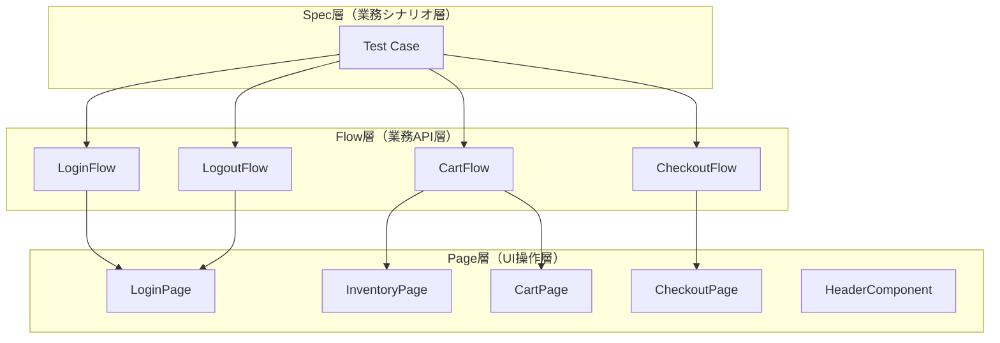
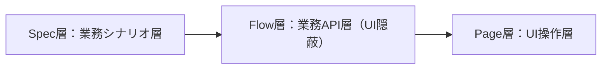
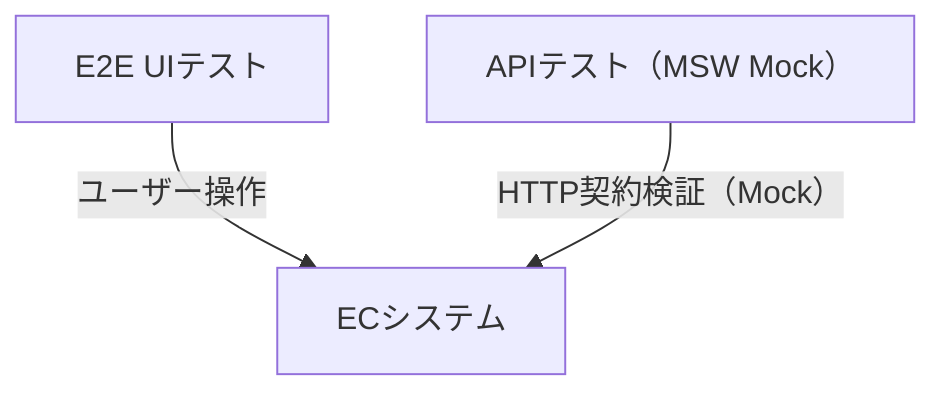
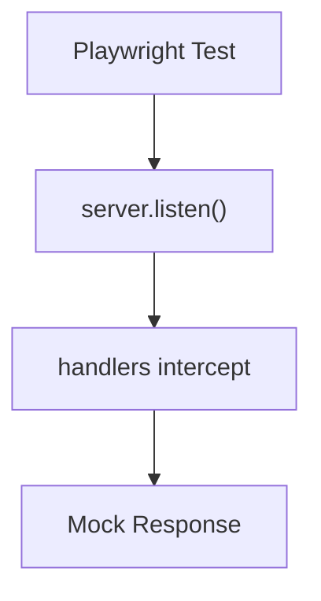
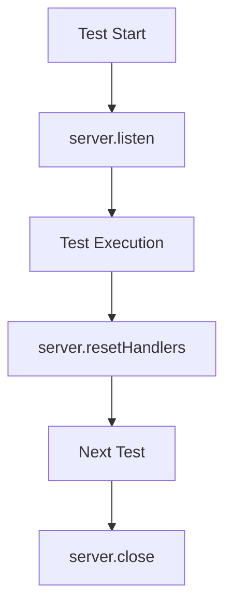

# Playwright 自動テストデモ（ECサイトE2Eテスト）

Playwright + TypeScript によるECサイト向けE2E自動テストポートフォリオです。

ログイン / カート / Checkout(購入) / ログアウト を対象に、保守性・拡張性・CI運用まで意識して実装しています。

**UI E2E + API Testing に対応 / GitHub ActionsによるCI自動実行対応**
---

## テスト設計概要

本プロジェクトでは、E2E観点に基づき「状態変化・業務フロー単位」でテストを設計しています。

---

### 合計件数について

本プロジェクトのテスト件数は固定値ではなく、
業務シナリオ単位での網羅結果として定義されています。

そのため、機能追加・仕様変更により増減する前提の設計です。

---

### プロジェクト方針

本プロジェクトはE2E観点でのユーザー操作フロー再現性と保守性を重視したテスト設計を採用しています。

詳細な設計思想は後述の「テスト設計方針」に整理しています。

---

### アーキテクチャ方針

保守性・拡張性・CI運用を考慮し、
Flow Layer / Page Object Model / Fixture / API Layer を組み合わせた構成を採用しています。

詳細な責務分離構成は後述の「テストアーキテクチャ構造」に整理しています。

- Page Object Model（POM）
- Fixtureによるログイン共通化
- Data-driven testing
- GitHub Actions による CI 自動実行

---

## 使用技術

- Playwright
- TypeScript
- Node.js
- GitHub Actions
- API Testing（APIRequestContext）
- Page Object Model
- Flow Layer Architecture
- Fixture / storageState
- Data-driven testing
- MSW（Mock Service Worker：APIモックレイヤー）

---

## テスト対象

**SauceDemo（テスト用デモサイト）**  
https://www.saucedemo.com/

および補助検証用API（MSW mock環境）

---

## テスト設計方針（重要）

本プロジェクトは、E2E観点でのユーザー操作フロー再現性と保守性を重視したテスト設計を採用しています。

---

### 設計思想

#### ① Page Object Model（POM）
画面操作を機能単位で分離し、UI変更の影響を局所化しています。

対象：
- InventoryPage
- CartPage
- CheckoutPage
- HeaderComponent

---

#### ② Fixtureによる認証状態の共通化
loginFixtureによりログイン状態を共通化し、各テストの前処理を削減しています。

---

#### ③ テスト観点の分離
本プロジェクトでは、機能単位ではなくユーザー操作ベースでテストを分類しています。

- Login：認証系
- Cart：状態変化系
- Checkout：購入フロー系
- Logout：セッション管理
- API：HTTP契約検証

---

## テストアーキテクチャ構造（3層モデル）

本プロジェクトは以下の3層構造でテストを設計しています。



---

### ■ Spec層（業務シナリオ層）
- テストケースの定義
- 業務フローの組み立て
- Flow Layerのみを呼び出す
- UI操作は一切記述しない

例：
- 「商品を購入できること」
- 「ログイン失敗時にエラーが出ること」

---

### ■ Flow層（業務フロー層）

- Page Objectを組み合わせた業務単位の操作を提供
- UI操作の詳細（セレクタ・DOM構造）を完全に隠蔽
- spec層からUI依存を排除
- テストシナリオを業務レベルで表現する抽象化レイヤー

例：
- login()
- addItems()
- startCheckout()
- completePurchase()
- verifyOrderComplete()



---

### ■ Page層（UI実装層）
- 画面単位の操作を定義
- セレクタ・DOM操作を集約
- UI変更時の影響をこの層に閉じ込める
- Flow / SpecにはUI詳細を漏らさない

例：
- LoginPage
- CartPage
- CheckoutPage
- InventoryPage

---

### ■ Flow実装例（LoginFlow）

本プロジェクトでは、Flow層が業務操作を抽象化しています。

UI操作（Page Object）を直接呼ぶのではなく、
業務単位のメソッドとしてまとめることで、spec層の可読性と保守性を向上させています。

---

### LoginFlow.ts（例）

```ts
export class LoginFlow {
  constructor(private loginPage: LoginPage) {}

  async login(username: string, password: string) {
    await this.loginPage.open();

    await this.loginPage.enterUsername(username);
    await this.loginPage.enterPassword(password);

    await this.loginPage.clickLogin();
  }
}
```

---

## テスト戦略（状態ベース設計）

本プロジェクトでは「操作ベース」ではなく  
状態変化ベースのテスト設計を採用しています。

---

### 例：カートテスト

商品追加 → カート件数増加  
商品削除 → カート件数減少  
全削除 → バッジ非表示  

---

このように「操作」ではなく  
状態遷移の正しさを検証しています。

---

### ■ テスト詳細仕様（設計補足）

各機能の詳細なテスト設計（観点・シナリオ・状態遷移）はGitHub Wikiに分離しています。

詳細設計（GitHub Wiki）：

https://github.com/Infinity941020/playwright-demo/wiki

- Login：認証フロー設計
- Cart：状態変化およびバッジ検証
- Checkout：E2E購入フロー設計
- Logout：セッション終了フロー

---

## Fixture対応（ログイン共通化）

本プロジェクトでは、Playwright Fixtureを利用して
ログイン済み状態を共通化しています。

### 現在の構成

- loginFixture.ts によるログイン済みPageの提供
- loggedPage を各テストで共通利用
- 前処理の重複排除
- テスト実行速度の最適化

### 拡張設計（将来対応）

- storageState（auth.json）による認証状態永続化に対応可能な設計
- setup/auth.setup.ts による認証準備構成

---

## Data-driven testing対応

繰り返しパターンの多いCheckoutテストでは、
テストケース配列を利用したdata-driven形式を採用しています。

また、購入者情報は checkoutData.ts に共通化し、
入力データ管理を分離しています。

### 対応内容

- テストケース配列によるパターン管理
- for ... of によるテスト生成
- checkoutData.ts による入力データ共通化
- ケース追加時の修正影響最小化

---

## API Testing（補助検証レイヤー）

本プロジェクトではUI E2Eテストに加えて、
バックエンド契約を補助的に検証するAPIテストを実装しています。

APIテストはUIテストとは独立した補助レイヤーとして扱い、
HTTPレベルでのリクエスト・レスポンス検証を行います。

UIテストの代替ではなく、
E2E品質を補強する役割を持ちます。

---

### 実装範囲

- Login API
  - 正常系（200）
  - 異常系（400）

- GET User API
  - 正常系（200）
  - 異常系（404）

- Cart API
  - 正常系（200 / 201 / 204）
  - 異常系（400）

- Checkout API
  - 正常系（201）
  - 異常系（400）

- Logout API
  - 正常系（200）
  - 未認証（401）
  - 異常系（400）

- request body バリデーション
- レスポンス構造検証（token / error / user data / checkoutId / success）

---

### アーキテクチャ設計

APIテストはUIと同様に責務分離されたレイヤー構造で設計しています。

■ Spec層
テストケースと検証観点のみを記述する層

■ API（制御層）
apiHelper / apiConfig / apiLogger によるリクエスト制御層

■ assertions（検証層）
レスポンス・UI状態の検証を行う層

■ schema（データ構造層）
APIレスポンスの型・構造定義

■ helpers（補助処理層）
テスト準備・前処理の共通化レイヤー

---

### 設計思想

本プロジェクトでは、以下の方針でAPIテストを設計しています。

- UI E2Eの補助検証として分離する
- HTTPレベルでの契約検証に限定する
- UI依存を持たない軽量テストとして扱う
- Spec層から実装詳細（HTTP/ヘッダー/エンドポイント）を排除する
- エンドポイント単位のAPIヘルパーで統一する（login / user / cart / checkout）

---

### ■ APIテスト実装例

APIテストでは、
Spec層からHTTP実装詳細を分離し、
Helper / Assertions / TestData を責務別に管理しています。

これにより、
Spec側では「何を検証するか」のみに集中できる構成としています。

また、
MSWを利用することで、
外部APIに依存しない安定したAPIテストを実現しています。

```ts
test('ログイン成功', async ({ request }) => {

  const response = await executeLoginApi(
    request,
    apiUsers.validUser
  );

  await expectLoginSuccess(response);
});

test('ログイン失敗（不正認証）', async ({ request }) => {

  const response = await executeLoginApi(
    request,
    {
      email: 'invalid@test.com',
      password: 'wrong-password'
    }
  );

  await expectLoginFailure(response);
});
```

---

### 今後の拡張

- 他APIエンドポイント追加
- 認証付きAPIテスト拡張
- E2Eとの統合検証（UI + API）

---

### 補足

UI E2EとAPI検証は、
独立した観点として分離しています。

APIテストはMSWによるMock Layer上で動作し、
外部API依存を排除した構成になっています。



---

## MSW（Mock Service Worker）構成

本プロジェクトでは、APIテストの安定化および外部依存排除のために
MSW（Mock Service Worker）を導入しています。

MSWは「実APIの代替レイヤー」として動作し、
Node / Playwright / CI 環境すべてで統一されたレスポンス制御を実現しています。

---

### ■ handlers構成

APIごとに責務分離されたモックレイヤーを構築しています。

---

### ■ loginHandlers
- POST /api/login
- 正常系：token返却（200）
- 異常系：user not found（400）

---

### ■ userHandlers
- GET /api/users/:id
- path parameter による動的レスポンス制御
- id=2 → 正常レスポンス（200）
- その他 → 404

---

### ■ cartHandlers
- POST /api/cart
- GET /api/cart
- DELETE /api/cart/:id
- 正常系 / 異常系 / 空リクエスト対応

---

### ■ checkoutHandlers
- POST /api/checkout
- 正常系（201）
- 異常系（400）
- バリデーションエラー対応

---

### ■ logoutHandlers
- POST /api/logout

#### ■ 正常系
- 200：{ success: true }

#### ■ 異常系
- 401：{ error: 'unauthorized' }
- 400：{ error: 'invalid request' }

セッション破棄を模擬したAPIとして設計し、
ログイン状態の終了処理を検証するために利用します。

---

### ■ Handler実装例

handlerでは、
request body の取得・条件分岐・mock response生成を行っています。

正常系 / 異常系レスポンスを明示的に分離することで、
APIテスト時に複数パターンのレスポンス検証を可能としています。

また、HTTP status code を含めてmock可能なため、
実APIに近いテスト構成を実現しています。

```ts
http.post(
  'https://reqres.in/api/login',
  async ({ request }) => {

    const body = await request.json();

    if (
      body.email === 'test@example.com' &&
      body.password === 'password123'
    ) {

      return HttpResponse.json(
        { token: 'mock-token' },
        { status: 200 }
      );
    }

    return HttpResponse.json(
      { error: 'user not found' },
      { status: 400 }
    );
  }
)
```

---

### ■ Handler統合管理

各handlerは `handlers/index.ts` で統合管理しています。

これにより、
MSW server側では単一のhandlers定義を利用でき、
handler追加時の保守性を向上させています。

handler責務とserver生成責務を分離することで、
mock構成の拡張性を確保しています。

```text
export const handlers = [
  ...loginHandlers,
  ...userHandlers,
];
```

---

### ■ MSW実行フロー



---

### ■ MSW Setup Lifecycle

MSWはPlaywright lifecycleに統合されており、
テスト開始時にmock serverを起動します。

各テスト終了後にはhandlerをリセットし、
テスト間でmock状態が汚染されないようにしています。

テスト完了後はserverを停止し、
不要なintercept状態を残さない構成としています。

また、`onUnhandledRequest: 'bypass'` を利用することで、
未定義APIへの通信を妨げず、
段階的にMSWを導入できる構成としています。

---

#### ■ msw.setup.ts

MSWの起動・handlerリセット・server停止は
`tests/setup/msw.setup.ts` に集約しています。

Playwright lifecycle hooks を利用することで、
全APIテストで共通のmock環境を利用可能としています。

また、
handler状態を各テストごとに初期化することで、
テスト間の独立性を保証しています。

---



---

### ■ MSW Server Configuration

MSW serverは `setupServer()` を利用して生成しています。

各handlerは責務ごとに分離されており、
server.ts 側で統合管理する構成としています。

これにより、
mock API追加時はhandlerを追加するだけで
server側へ容易に組み込み可能となっています。

また、Node / Playwright / CI 環境で
同一mock serverを利用できる構成としており、
実行環境差異を最小化しています。

```ts
const handlers = [
  ...loginHandlers,
  ...userHandlers,
];

export const server = setupServer(
  ...handlers
);
```

---

### ■ テストとの連携

test → server.listen → handler intercept → mock response

---
### ■ 設計意図

- 外部API依存の完全排除
- APIレスポンスの完全制御
- CI環境での安定性確保
- テスト間での独立性保証
- ハンドラー単位の責務分離

---

## Utility Layer（共通処理）

本プロジェクトでは、テスト補助・API制御・データ検証を責務別に分離しています。
utils配下では、
API制御・検証・データ構造・テスト補助処理を
責務ごとにディレクトリ分離しています。

---

### ■ api（API制御層）

APIリクエストの共通処理を担当するレイヤー。

- apiHelper.ts
- apiConfig.ts
- apiLogger.ts

---

### ■ apiHelper.ts 対応API一覧

本プロジェクトではAPIごとに責務を分離し、
以下のエンドポイントを統一的に管理しています。

---

### ■ Login API
- executeLoginApi

---

### ■ User API
- executeGetUserApi

---

### ■ Cart API
- executeAddCartApi
- executeGetCartApi
- executeDeleteCartApi

---

### ■ Checkout API
- executeCheckoutApi

---

### ■ Logout API
- executeLogoutApi

---

### 設計意図

- APIごとに実行関数を1:1で管理
- Spec層からHTTP詳細を完全に隠蔽
- Logoutを独立APIとして扱い、認証終了責務を明確化
- MSWによるMock制御前提で設計
- ステートレス設計によりテスト間依存を排除
- UI/E2Eと同様にAPIも「業務単位」で抽象化
- 各レイヤー（assertions / schema / helpers）はAPI間で責務粒度を統一し、特定APIに依存しない構造としています。

---

### ■ assertions（検証レイヤー）

APIレスポンスおよびUI状態の検証処理を集約。

- loginAssertions.ts
- userAssertions.ts
- cartAssertions.ts
- checkoutAssertions.ts
- cartBadgeAssertions.ts
- commonAssertions.ts
- logoutAssertions.ts

---

### ■ schema（データ構造定義）

APIレスポンス構造の型定義・バリデーション管理。

- loginSchema.ts
- userSchema.ts

※ Logout APIはセッション破棄を目的としたエンドポイントのため、レスポンス構造が固定的であり専用schemaは設けていません。

---

### ■ helpers（テスト補助処理）

- loginHelper.ts
- cartHelper.ts
- checkoutHelper.ts

---

### ■ urls.ts
アプリケーションURL管理

---

### 設計意図

- Arrange処理の共通化
- 前準備コードの重複排除
- Flow層責務の明確化

---

### 補足

- HelperはFlowより軽い「テスト準備レイヤー」
- Flowは「業務シナリオ実行レイヤー」
- HelperはFlowの前段階として動作する

---

## フォルダ構成

```text
pages/
 ├ LoginPage.ts
 ├ InventoryPage.ts
 ├ CartPage.ts
 ├ HeaderComponent.ts
 ├ MenuPage.ts
 └ CheckoutPage.ts

flows/
 ├ LoginFlow.ts
 ├ CartFlow.ts
 ├ CheckoutFlow.ts
 └ LogoutFlow.ts

tests/
 ├ setup/
 │   ├ auth.setup.ts
 │   └ msw.setup.ts
 │
 ├ api/
 │   ├ cart-api.spec.ts
 │   ├ checkout-api.spec.ts
 │   ├ login-api.spec.ts
 │   └ user-api.spec.ts
 │
 ├ login/
 │   ├ login-success.spec.ts
 │   └ login-failure.spec.ts
 │
 ├ cart/
 │   ├ cart.spec.ts
 │   └ cart-badge.spec.ts
 │
 ├ checkout/
 │   ├ checkout-success.spec.ts
 │   ├ checkout-failure.spec.ts
 │   └ checkout-cancel.spec.ts
 │
 └ logout/
     └ logout.spec.ts

fixtures/
 └ loginFixture.ts

utils/
 ├ api/
 │   ├ apiHelper.ts
 │   ├ apiConfig.ts
 │   ├ apiLogger.ts
 │
 ├ assertions/
 │   ├ loginAssertions.ts
 │   ├ userAssertions.ts
 │   ├ cartAssertions.ts
 │   ├ checkoutAssertions.ts
 │   ├ cartBadgeAssertions.ts
 │   └ commonAssertions.ts
 │
 ├ schema/
 │   ├ loginSchema.ts
 │   └ userSchema.ts
 │
 ├ helpers/
 │   ├ loginHelper.ts
 │   ├ cartHelper.ts
 │   ├ checkoutHelper.ts
 │
 └ urls.ts

data/
 ├ users.ts
 ├ checkoutData.ts
 └ apiUsers.ts

mocks/
 ├ server.ts
 └ handlers/
     ├ index.ts
     ├ loginHandlers.ts
     ├ userHandlers.ts
     ├ cartHandlers.ts
     ├ checkoutHandlers.ts
     └ logoutHandlers.ts

```
### ディレクトリ責務

- pages/：UI操作実装層（Page Object）
- flows/：業務フロー抽象化層
- fixtures/：共通前処理・ログイン状態管理
- utils/：API制御・検証・schema・Helper管理層
- data/：テストデータ管理
- mocks/：MSW mock API管理層
- tests/：テストケース本体

## 実行方法

### 全テスト実行

```bash
npx playwright test

```

### UIモード

```bash
npx playwright test --ui

```

### 特定ファイル実行

```bash
npx playwright test tests/checkout/checkout-success.spec.ts --reporter=list

```

### Checkoutのみ実行

```bash
npx playwright test tests/checkout --reporter=list

```

## CI（GitHub Actions）

mainブランチへのpush / Pull Request時に  
自動で全テストを実行し、品質確認を継続的に行える構成です。

---

### 実行タイミング

- mainブランチへのpush
- Pull Request作成時

---

### 自動実行内容

- Node.jsセットアップ
- 依存関係インストール
- Playwrightブラウザセットアップ
- 全テスト実行

---

## Playwright実行設定

本プロジェクトでは、
CI環境とローカル開発環境で
Playwright設定を切り替えています。

CIでは安定実行を重視し、
retry・worker制御・失敗時のみ証跡保存を採用しています。

一方、ローカル環境では
デバッグ効率を重視し、
trace / video の常時取得および slowMo を有効化しています。

これにより、
CI安定性とローカル解析性の両立を実現しています。

```ts
const isCI = !!process.env.CI;

retries: isCI ? 2 : 0,

workers: isCI ? 2 : undefined,

trace: isCI
  ? 'on-first-retry'
  : 'on',
```

---

## Checkout設計思想

Checkoutは以下3段階で構成されています：

① 商品選択（Inventory）  
② 情報入力（Checkout Form）  
③ 確認・完了（Complete）

---

### テスト分類

- 正常系：購入完了までのフロー
- 異常系：入力バリデーション
- キャンセル系：途中離脱動作

---

## プロジェクトの強み

本プロジェクトは以下の特徴を持つE2E自動テスト構成です。

- 業務フロー単位で設計されたE2Eテスト（Flowレイヤー導入）
- Page Object + Fixtureによる高い保守性と再利用性
- 状態ベース設計による安定したE2E検証
- GitHub ActionsによるCI自動化で継続品質担保

---

## 最近の改善実績

- CheckoutFlowの責務整理（UI操作抽象化）
- Helper層の分離（login / cart / checkout）
- checkoutHelper導入による前準備共通化
- data-drivenテスト構成の最適化
- test.step導入によるレポート可視化改善
- GitHub Actions CI安定化
- E2Eテスト30件の安定PASS維持

---

## 改善予定

- テストデータ管理のさらなる外部化（JSON / Fixture連携）
- APIテスト拡張（cart / checkout API対応強化）
- Visual Regressionテスト導入
- Page Objectのさらなる責務分離最適化
- Playwright Projectsによるブラウザ並列実行対応
- API mock data管理の外部化
- レポート自動通知（Slack / Teams）

---

## 作成者

テスト自動化学習および実務レベルの設計・運用を意識して作成した
Playwright E2Eテストポートフォリオです。

単純なUI自動化ではなく、
保守性・責務分離・CI運用・API補助検証まで含めた
継続運用可能なテスト構成を目指して設計しています。